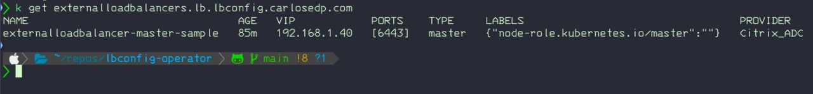

# External Load Balancer Operator

[](https://codecov.io/gh/carlosedp/lbconfig-operator)
[](https://github.com/carlosedp/lbconfig-operator/actions/workflows/go.yml)
[](https://github.com/carlosedp/lbconfig-operator/actions/workflows/check-bundle.yml)
[](https://goreportcard.com/report/github.com/carlosedp/lbconfig-operator)


The LBConfig Operator, manages the configuration of External Load Balancer instances (on third-party equipment via it's API) and creates VIPs and IP Pools with Monitors for a set of OpenShift or Kubernetes nodes like Master-nodes (Control-Plane), Infra nodes (where the Routers or Ingress controllers are located) or based on it's roles and/or labels.

The operator dynamically handles creating, updating or deleting the IPs of the pools in the Load Balancer based on the Node IPs for each role or label. On every change of the operator configuration (CRDs) or addition/change/removal or cluster Nodes, the operator updates the Load Balancer properly.

The objective is to have a modular architecture allowing pluggable backends for different load balancer providers.

To use the operator, you will need a Kubernetes cluster to run against. You can use [KIND](https://sigs.k8s.io/kind) to get a local cluster for testing, or run against a remote cluster.
**Note:** Your controller will automatically use the current context in your kubeconfig file (`~/.kube/config`) (i.e. whatever cluster `kubectl cluster-info` shows).

Quick demo:

[](https://www.youtube.com/watch?v=4b7oYA4nO5I)

## Who is it for

The main users for this operator is enterprise deployments or clusters composed of multiple nodes having an external load-balancer providing the balancing and high-availability to access the cluster in both API and Application levels.

## High level architecture


## Using the Operator

### Deploy the Operator to your cluster

Apply the operator manifest into the cluster:

```sh
kubectl apply -f https://github.com/carlosedp/lbconfig-operator/raw/v0.3.0/manifests/deploy.yaml
```

This creates the operator Namespace, CRD and deployment using the latest container version. The container image is built for `amd64`, `arm64` and `ppc64le` architectures.

### Create ExternalLoadBalancer Instances

Create the instances for each Load Balancer instance you need (for example one for Master Nodes and another for the Infra Nodes). **If installing on OpenShift or Kubernetes with OLM (or in a different namespace), adjust the sample YAMLs to match the created namespace**.

**The provider `vendor` field can be (case-sensitive):**

* **`F5_BigIP`** - Tested on F5 BigIP version 15
* **`Citrix_ADC`** - Tested on Citrix ADC (Netscaler) version 13
* **`Dummy`** - Dummy backend used for testing to only print log messages on operations

Create the secret holding the Load Balancer API user and password:

```sh
oc create secret generic f5-creds --from-literal=username=admin --from-literal=password=admin123 --namespace lbconfig-operator-system
```

After creating the CR, `kubectl get` output shows each ExternalLoadBalancer instance details:



#### Sample CRDs and Available Fields

Master Nodes using a Citrix ADC LB:

```yaml
apiVersion: lb.lbconfig.carlosedp.com/v1
kind: ExternalLoadBalancer
metadata:
  name: externalloadbalancer-master-sample
  namespace: lbconfig-operator-system
spec:
  vip: "192.168.1.40"
  type: "master"
  ports:
    - 6443
  monitor:
    path: "/healthz"
    port: 6443
    monitortype: "https"
  provider:
    vendor: Citrix_ADC
    host: "https://192.168.1.36"
    port: 443
    creds: netscaler-creds
    validatecerts: false
```

Infra Nodes using a F5 BigIP LB:

```yaml
apiVersion: lb.lbconfig.carlosedp.com/v1
kind: ExternalLoadBalancer
metadata:
  name: externalloadbalancer-infra-sample
  namespace: lbconfig-operator-system
spec:
  vip: "192.168.1.45"
  type: "infra"
  ports:
    - 80
    - 443
  monitor:
    path: "/healthz"
    port: 1936
    monitortype: http
  provider:
    vendor: F5_BigIP
    host: "https://192.168.1.35"
    port: 443
    creds: f5-creds
    partition: "Common"
    validatecerts: false
```

To choose the nodes which will be part of the server pool, you can set either `type` or `nodelabels` fields. The yaml field `type: "master"` or `type: "infra"` selects nodes with the role label `"node-role.kubernetes.io/master"` and `"node-role.kubernetes.io/infra"` respectively. If the field `nodelabels` array is used instead, the operator will use nodes which match all labels.

If you have in your cluster Infra-Nodes for different roles (for example Infra-nodes dedicated for OpenShift Data Foundation), don't use `type: "infra"` config as the Load Balancer will point to all nodes with that label. Instead use the `nodelabels:` syntax as below specifying the correct labels for the nodes that have the routers/ingress controllers. The listed labels follow an "AND" rule.

Clusters with sharded routers or using arbitrary labels to determine where the Ingress Controllers run can be configured like:

```yaml
spec:
  vip: "10.0.0.6"
  ports:
    - 80
  nodelabels:
    "node.kubernetes.io/ingress-controller": "production"
    "kubernetes.io/region": "DC1"
  ...
```

## Additional information

Please check the [additional documentation](docs/Readme.md) with more information like tracing, adding new providers, development and more.

## Disclaimers

* The operator does not check if the requested configuration (names, IPs) already exists and/or conflicts with existing configuration in the Load Balancer. The user is responsible for these checks before deployment;
* I am not responsible if the operator changes/deletes existing configuration on the Load Balancer if existing names are already configured.
* The operator creates the entries(Pools, VIPs, Monitors) in the provided Load Balancer with the `name` of the instance configured in the CustomResource prefixed with the type. Eg. For a CR with name `externalloadbalancer-master-sample`, the operator creates a server pool named `Pool-externalloadbalancer-master-sample-6443` (suffixed with the port), a monitor named `Monitor-externalloadbalancer-master-sample` and a VIP named `VIP-externalloadbalancer-master-sample-6443` (suffixed with the port).
