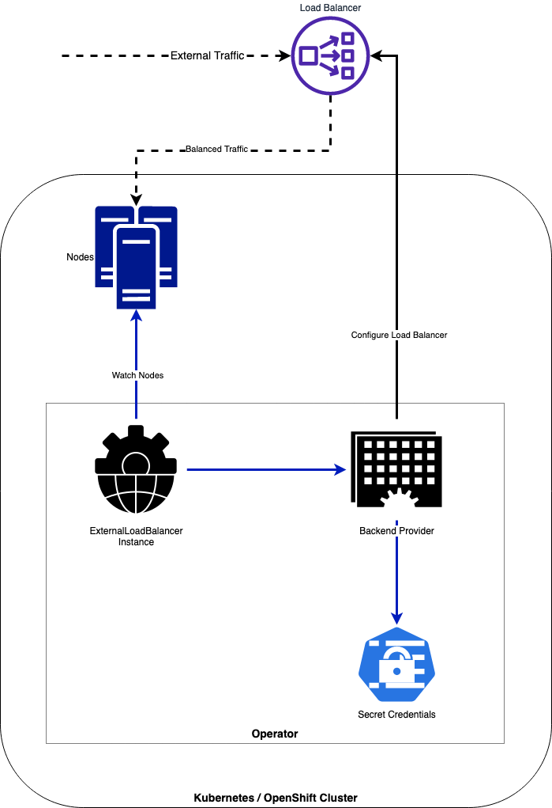

# External Load Balancer Operator

[](https://codecov.io/gh/carlosedp/lbconfig-operator)
[](https://github.com/carlosedp/lbconfig-operator/actions/workflows/go.yml)
[](https://github.com/carlosedp/lbconfig-operator/actions/workflows/check-bundle.yml)
[](https://goreportcard.com/report/github.com/carlosedp/lbconfig-operator)

**This is still a work-in-progress project.**

This operator manages external Load Balancer instances and creates VIPs and IP Pools with Monitors for the Master and Infra nodes based on it's roles and/or labels.

The IPs are updated automatically based on the Node IPs for each role or label. The objective is to have a modular architecture to allow plugging additional backends for different load balancer providers.

You’ll need a Kubernetes cluster to run against. You can use [KIND](https://sigs.k8s.io/kind) to get a local cluster for testing, or run against a remote cluster.
**Note:** Your controller will automatically use the current context in your kubeconfig file (`~/.kube/config`) (i.e. whatever cluster `kubectl cluster-info` shows).

Quick demo:

[](https://www.youtube.com/watch?v=4b7oYA4nO5I)

## Who is it for

The main users for this operator is enterprise deployments or clusters composed of multiple nodes having an external load-balancer providing the balancing and high-availability to access the cluster in both API and Application levels.

## High level architecture



## Install

### Deploy the Operator to your cluster

Apply the operator manifest into the cluster:

```sh
kubectl apply -f https://github.com/carlosedp/lbconfig-operator/raw/master/manifests/deploy.yaml
```

### Create ExternalLoadBalancer instances

Create the instances for each Load Balancer instance you need (for example one for Master Nodes and another for the Infra Nodes).

The yaml field `type: "master"` or `type: "infra"` selects nodes with the role label `"node-role.kubernetes.io/master"` and `"node-role.kubernetes.io/infra"` respectively. If the field is ommited, the nodes will be selected by the `nodelabels` labels array.

The provider `vendor` field can be (case-insensitive):

* F5_BigIP
* Citrix_ADC
* Dummy

Create the secret holding the Load Balancer API user and password:

```sh
oc create secret generic f5-creds --from-literal=username=admin --from-literal=password=admin123 --namespace lbconfig-operator-system
```

#### Sample CRDs

Master Nodes:

```yaml
apiVersion: lb.lbconfig.io/v1
kind: ExternalLoadBalancer
metadata:
  name: externalloadbalancer-master-sample
  namespace: lbconfig-operator-system
spec:
  vip: "192.168.1.40"
  type: "master"
  provider:
    vendor: F5_BigIP
    host: "192.168.1.35"
    port: 443
    creds: f5-creds
    partition: "Common"
    validatecerts: no
  ports:
    - 6443
  monitor:
    path: "/healthz"
    port: 6443
    monitortype: "https"
```

Infra Nodes:

```yaml
apiVersion: lb.lbconfig.io/v1
kind: ExternalLoadBalancer
metadata:
  name: externalloadbalancer-infra-sample-shard
  namespace: lbconfig-operator-system
spec:
  vip: "10.0.0.6"
  type: "infra"
  provider:
    vendor: F5_BigIP
    host: "192.168.1.35"
    port: 443
    creds: f5-creds
    partition: "Common"
    validatecerts: no
  ports:
    - 80
    - 443
  monitor:
    path: "/healthz"
    port: 1936
```

Nodes with sharded routers or arbitrary labels are also supported. Create the YAML adding the `nodelabels` field with your node labels.

```yaml
spec:
  vip: "10.0.0.6"
  nodelabels:
    "node.kubernetes.io/region": "production"
  ...
```

## Developing and Building

This project aims to follow the Kubernetes [Operator pattern](https://kubernetes.io/docs/concepts/extend-kubernetes/operator/)

It uses [Controllers](https://kubernetes.io/docs/concepts/architecture/controller/)
which provides a reconcile function responsible for synchronizing resources untile the desired state is reached on the cluster

There are multiple `make` targets available to ease development.

1. Build binary: `make`
2. Install CRDs in the cluster: `make install`
3. Deploy the operator manifests to the cluster: `make deploy`
4. Create CRs in cluster (secret, backend and LB)

To run the operator in your dev machine without deploying it to the cluster (using configurations use the defined in the `$HOME/.kube/config`), do not use `make deploy`, instead do:

1. Run `make install` to create the CRDs as above;
2. Create the operator namespace with `kubectl create namespace lbconfig-operator-system`;
3. Create CRs (secret, backend, LB) as normal in the same namespace.
4. Use `make run` to run the operator locally;

To remove the manifests to the cluster: `make undeploy`

## Distribute

Building the manifests and docker images: `make dist`.

Operator deployment manifest bundle is created at `./manifests/deploy.yaml`.

The sample manifests for LoadBalancer instances and backends are in `./config/samples` folder.

## Adding new Providers

* Create a package directory at `controllers/backend` with provider name
* Create the provider code with CRUD matrix of functions implementing the `Provider` interface
* Create the test file using Ginkgo
* Add the new package to be loaded by the [`controllers/backend/backend_loader/backend_loader.go`](controllers/backend/backend_loader/backend_loader.go) as an `_` import

## Planned Features

* Add Multiple backends (not in priority order)
  * [x] F5 BigIP
  * [x] Citrix ADC (Netscaler)
  * [ ] HAProxy
  * [ ] NGINX
  * [ ] NSX
  * [x] Dummy backend
* [ ] Dynamic port configuration from NodePort services
* [ ] Check LB configuration on finalizer
* [ ] Add tests
* [ ] Add Metrics/Tracing/Stats
* [x] Upgrade to go.kubebuilder.io/v3 - <https://master.book.kubebuilder.io/migration/v2vsv3.html>

