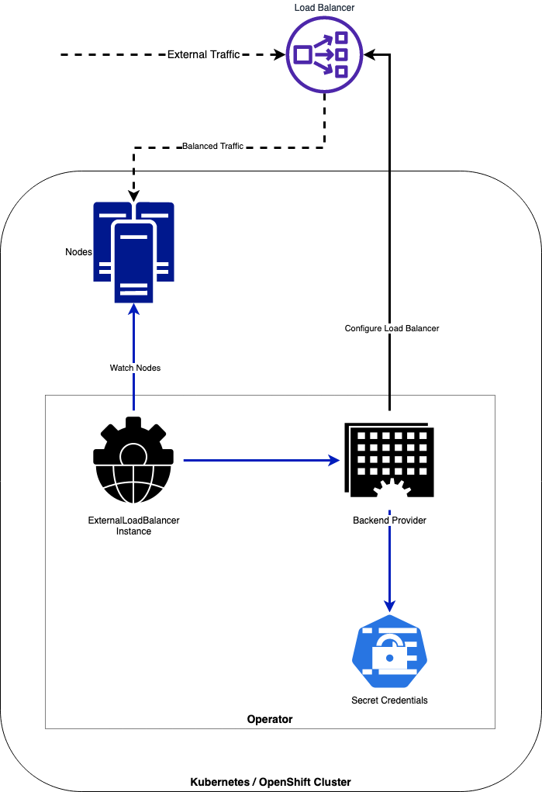

# ExternalLoadBalancer Operator Documentation <!-- omit in toc -->

This file aggregates all documentation for the operator. Some information is also in the main Readme.

## Contents <!-- omit in toc -->

- [Additional documents](#additional-documents)
- [High level architecture](#high-level-architecture)
- [Using the Operator](#using-the-operator)
  - [Deploy the Operator to your cluster](#deploy-the-operator-to-your-cluster)
  - [Create ExternalLoadBalancer instances](#create-externalloadbalancer-instances)
    - [Sample CRDs and Available Fields](#sample-crds-and-available-fields)
- [Health Check](#health-check)
- [Prometheus Metrics](#prometheus-metrics)
- [Planned Features](#planned-features)

## Additional documents

- [Adding new Backends](Creating_Backends.md)
- [Operator Tracing with Jaeger](Tracing.md)
- [Developing and Testing](Developing_Testing.md)
- [End-to-End Testing Guide](E2E_Testing.md)
- [HAProxy Backend](./haproxy/Readme.md)
- [Graceful Connection Draining](../config/samples/DRAIN_EXAMPLES.md)
- [Releasing a new version](./Release_new_version.md)


The LBConfig Operator, manages the configuration of External Load Balancer instances (on third-party equipment via it's API) and creates VIPs and IP Pools with Monitors for a set of OpenShift or Kubernetes nodes like Master-nodes (Control-Plane), Infra nodes (where the Routers or Ingress controllers are located) or based on it's roles and/or labels.

The operator dynamically handles creating, updating or deleting the IPs of the pools in the Load Balancer based on the Node IPs for each role or label. On every change of the operator configuration (CRDs) or addition/change/removal or cluster Nodes, the operator updates the Load Balancer properly.

## High level architecture



## Using the Operator

### Deploy the Operator to your cluster

Apply the operator manifest into the cluster:

```sh
kubectl apply -f https://github.com/carlosedp/lbconfig-operator/raw/v0.2.0/dist/install.yaml
```

This creates the operator Namespace, CRD and deployment using the latest container version. The container image is built for `amd64`, `arm64`, `ppc64le` and `s390x` architectures.

### Create ExternalLoadBalancer instances

Create the instances for each Load Balancer instance you need (for example one for Master Nodes and another for the Infra Nodes).

**The provider `vendor` field can be (case-sensitive):**

- **`F5_BigIP`** - Tested on F5 BigIP version 15
- **`Citrix_ADC`** - Tested on Citrix ADC (Netscaler) version 13
- **`HAProxy`** - HAProxy with Dataplane API. ([Docs](./docs/haproxy/))
- **`Dummy`** - Dummy backend used for testing to only print log messages on operations

Create the secret holding the Load Balancer API user and password:

```sh
oc create secret generic f5-creds --from-literal=username=admin --from-literal=password=admin123 --namespace lbconfig-operator-system
```

#### Sample CRDs and Available Fields

Master Nodes using a Citrix ADC LB:

```yaml
apiVersion: lb.lbconfig.carlosedp.com/v1
kind: ExternalLoadBalancer
metadata:
  name: externalloadbalancer-master-sample
  namespace: lbconfig-operator-system
spec:
  vip: "192.168.1.40"
  type: "master"
  ports:
    - 6443
  monitor:
    path: "/healthz"
    port: 6443
    monitortype: "https"
  provider:
    vendor: Citrix_ADC
    host: "https://192.168.1.36"
    port: 443
    creds: netscaler-creds
    validatecerts: false
```

Infra Nodes using a F5 BigIP LB:

```yaml
apiVersion: lb.lbconfig.carlosedp.com/v1
kind: ExternalLoadBalancer
metadata:
  name: externalloadbalancer-infra-sample
  namespace: lbconfig-operator-system
spec:
  vip: "192.168.1.45"
  type: "infra"
  ports:
    - 80
    - 443
  monitor:
    path: "/healthz"
    port: 1936
    monitortype: http
  provider:
    vendor: F5_BigIP
    host: "https://192.168.1.35"
    port: 443
    creds: f5-creds
    partition: "Common"
    validatecerts: false
```

To choose the nodes which will be part of the server pool, you can set either `type` or `nodelabels` fields. The yaml field `type: "master"` or `type: "infra"` selects nodes with the role label `"node-role.kubernetes.io/master"` and `"node-role.kubernetes.io/infra"` respectively. If the field `nodelabels` array is used instead, the operator will use nodes which match all labels.

If you have in your cluster Infra-Nodes for different roles (for example Infra-nodes dedicated for OpenShift Data Foundation), don't use `type: "infra"` config as the Load Balancer will point to all nodes with that label. Instead use the `nodelabels:` syntax as below specifying the correct labels for the nodes that have the routers/ingress controllers. The listed labels follow an "AND" rule.

Clusters with sharded routers or using arbitrary labels to determine where the Ingress Controllers run can be configured like:

```yaml
spec:
  vip: "10.0.0.6"
  ports:
    - 80
  nodelabels:
    "node.kubernetes.io/ingress-controller": "production"
    "kubernetes.io/region": "DC1"
  ...
```

#### Graceful Connection Draining

The operator supports graceful connection draining to prevent connection drops when pool members are removed during node maintenance, cluster upgrades, or autoscaling operations. When enabled, the operator orchestrates a 3-phase process:

1. **Disable**: The pool member is disabled on the load balancer, preventing new connections while allowing existing connections to continue
2. **Wait**: The operator waits for a configurable timeout period to allow existing connections to complete naturally
3. **Delete**: After the timeout expires, the pool member is fully removed from the load balancer

This time-based approach is simple, predictable, and works consistently across all load balancer providers without requiring complex connection tracking.

**Configuration:**

```yaml
spec:
  drain:
    enabled: true           # Enable graceful draining (default: false)
    timeoutSeconds: 30      # Timeout in seconds (default: 30, min: 1, max: 3600)
  ...
```

**Provider Support:**

The F5 BigIP, Citrix ADC and HAProxy providers support graceful draining with provider-specific implementations:

- **F5 BigIP**: Uses session `user-disabled` state for native graceful drain support
- **Citrix ADC/NetScaler**: Uses graceful service disable, entering TROFS (Transition Out of Service) state
- **HAProxy**: Uses maintenance mode via the DataPlane API (closest available to drain state)
- **Dummy**: Does not keep pool state, so members are never drained

**Use Cases and Recommended Timeouts:**

- **Short-lived connections (30-60s)**: REST APIs, standard HTTP applications, API gateways
- **Long-running connections (5-10min)**: WebSocket connections, SSE, long-polling, file uploads/downloads, streaming APIs
- **Immediate removal**: Keep draining disabled (the default) for very short-lived connections or applications that handle reconnection gracefully

**State Tracking:**

Draining members are tracked in the ExternalLoadBalancer status, persisting across reconciliation loops and operator restarts:

```yaml
status:
  drainingMembers:
    - poolName: "Pool-api-6443"
      node:
        name: "worker-3"
        host: "10.0.1.23"
      port: 6443
      startTime: "2025-12-10T21:50:00Z"
```

If a node comes back before its drain timeout expires (for example its label is re-applied), its member is re-enabled on the load balancer instead of being deleted.

For detailed examples, configuration guidance, and troubleshooting, see the [Graceful Connection Draining documentation](../config/samples/DRAIN_EXAMPLES.md).

Some fields inside `providers` are optional and depend on the used backend. Check the [API docs](https://pkg.go.dev/github.com/carlosedp/lbconfig-operator/api/v1?utm_source=gopls#Provider) which fields are backend-specific.

CRD Fields:

```yaml
apiVersion: lb.lbconfig.carlosedp.com/v1  # This is the API used by the operator (mandatory)
kind: ExternalLoadBalancer                # This is the object the operator manages (mandatory)
metadata:
  name: externalloadbalancer-master-sample  # Load Balancer instance configuration name (mandatory)
  namespace: lbconfig-operator-system       # The instance namespace (same as the operator runs) (mandatory)
spec:
  vip: "192.168.1.40"     # This is the VIP that will be created on the Load Balancer for this instance (mandatory)
  type: "master"          # Type could be "master" or "infra" that maps to OpenShift labels (optional)
  nodelabels:             # List of labels to be used instead of "type" field (optional)
    - "node.kubernetes.io/ingress": "production"   # Example label used to fetch the Node IPs by this instance (optional)
  ports:
    - 6443                # Port list which the Load Balancer will be forwarding the traffic (mandatory)
  monitor:
    path: "/healthz"      # Monitor URL to be configured in the Load Balancer instance
    port: 6443            # Monitor port to be configured in the Load Balancer instance
    monitortype: "https"  # Monitor protocol to be configured in the Load Balancer instance
  drain:                  # Optional graceful connection draining configuration (optional)
    enabled: true         # Enable graceful draining when removing pool members (default: false) (optional)
    timeoutSeconds: 30    # Time to wait before deleting members (default: 30, min: 1, max: 3600) (optional)
  provider:               # This section defines the backend provider or vendor of the Load Balancer
    vendor: F5_BigIP      # See supported vendors in the section above (mandatory)
    host: "192.168.1.35"  # The IP of the API for the Load Balancer to be managed (mandatory)
    port: 443             # The port of the API for the Load Balancer to be managed (mandatory)
    creds: f5-creds       # The name of the Kubernetes Secret created with username and password to the API (mandatory)
    partition: "Common"   # The partition for the F5 Load Balancer to be used (optional, only for F5_BigIP provider)
    validatecerts: false  # Should check the certificates if API uses HTTPS (true or false) (optional)
```

For more details, check the API documentation at <https://pkg.go.dev/github.com/carlosedp/lbconfig-operator/apis/lb.lbconfig.carlosedp.com/v1?utm_source=gopls#pkg-types>.

## Health Check

The operator publishes a health check endpoint via HTTP on `http://localhost:8081/healthz`.

## Prometheus Metrics

The operator exports two metrics. One counts the amount of ExternalLoadBalancers the operator is currently managing and another exposes the amount of nodes managed by each instance of ExternalLoadBalancer with appropriate metric labels.

```sh
# HELP externallb_total Number of external load balancers configured
# TYPE externallb_total gauge
externallb_total 1
# HELP externallb_nodes Number of nodes for the load balancer instance
# TYPE externallb_nodes gauge
externallb_nodes{ip="192.168.1.40",name="externalloadbalancer-master-sample",namespace="lbconfig-operator-system",port="6443",type="master"} 3
```

The metrics API is exposed on the operator container using port 8080 on `/metrics`. If testing, the metrics can be shown in `http://localhost:8080/metrics`

## Planned Features

- Add Multiple backends (not in priority order)
  - [x] F5 BigIP
  - [x] Citrix ADC (Netscaler)
  - [x] HAProxy
  - [ ] NGINX
  - [ ] NSX
  - [x] Dummy backend
- [ ] Dynamic port configuration from NodePort services
- [ ] Check LB configuration on finalizer
- [x] Add tests
- [x] Add Metrics/Tracing/Stats
- [x] Upgrade to go.kubebuilder.io/v3 - <https://master.book.kubebuilder.io/migration/v2vsv3.html>
