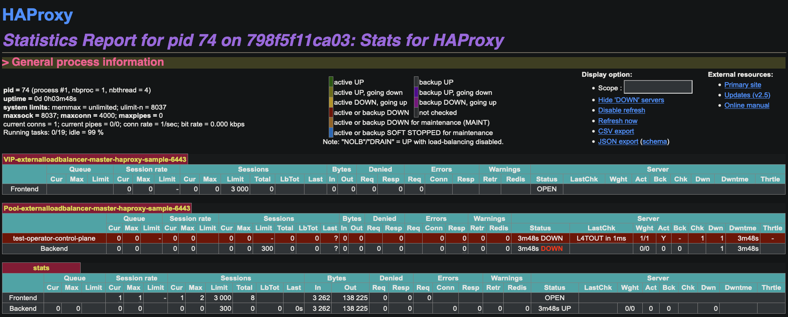

# HAProxy Test and Config with Dataplane API

This directory has information about how to run HAProxy with the Dataplane API on Docker and also how to deploy it using Ansible to a Physical or Virtual machine.

The operator will configure the container or VM (or Physical machine) HAProxy to listen on the defined VIP from the CustomResource YAML so **it's assumed that the host running HAProxy already have that IP address configured** into it's own network interface(s) so HAProxy can bind it's Frontend to the defined VIP.

If using a dedicated HAProxy instance for your cluster, you can use `"*"` as the VIP field in the YAML file for your ExternalLoadBalancer instance. This will make HAProxy bind to all IPs of the host it's currently running.

## Testing with a Docker container

To test the backend with an HAProxy running on a Docker container, use the provided configuration and docker-composer files from [haproxy-compose](haproxy-compose/) directory.

To start, run `docker-compose up -d`, it will load the config files from the `cfg` directory and start the Dataplane API in port 5555.

Dataplane API will manage the `cfg/haproxy.cfg` file and update it dynamically. The container exposes port `80 at 8088` and `443 at 8083`. Port `5555` is the API and port `1936` the statistics shown at `http://<IP>:1936/stats`.

To reset the configuration, stop the container with `docker-compose down` and replace the `cfg/haproxy.cfg` file with the `haproxy.cfg.tpl` file with `cp haproxy.cfg.tpl cfg/haproxy.cfg` then, start the container again.

## Deploy with Ansible to Physical or Virtual Machines

Soon an Ansible playbook will be provided to deploy HAProxy in High-Avaliability mode with Keepalived on multiple machines.
